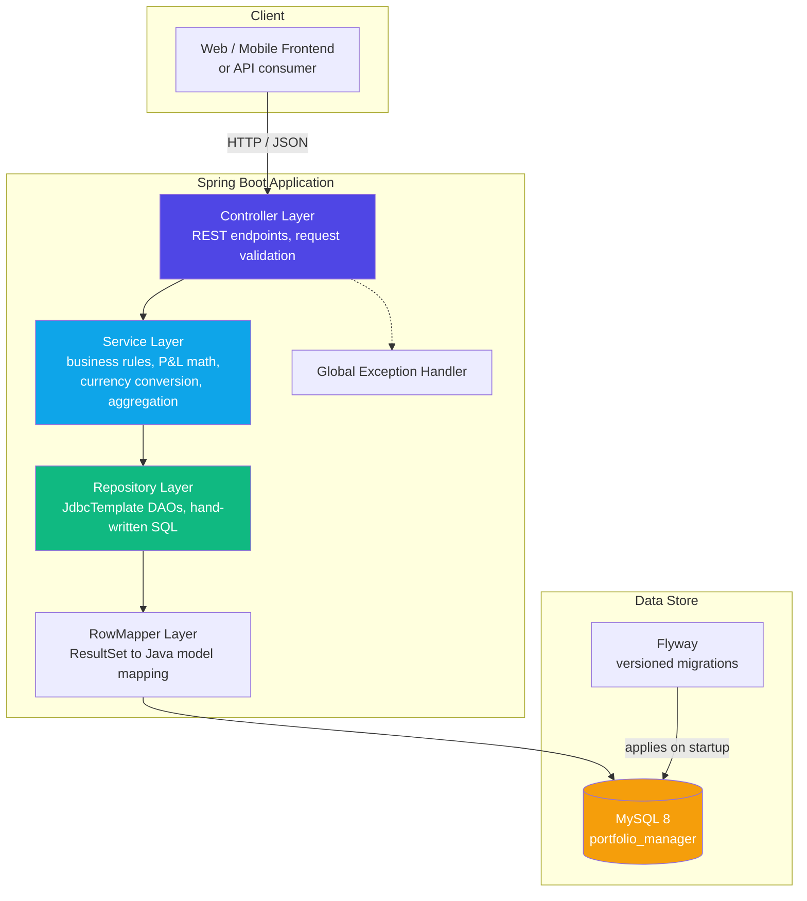
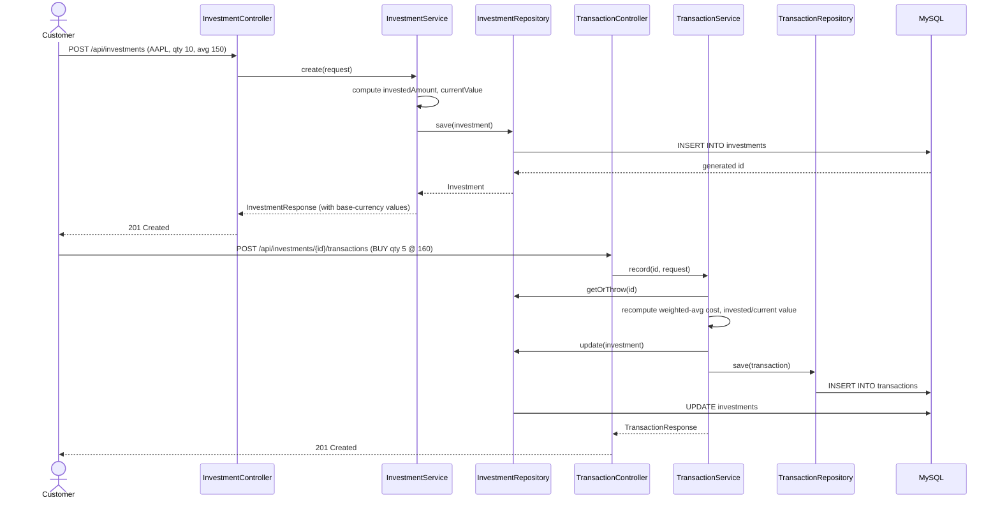
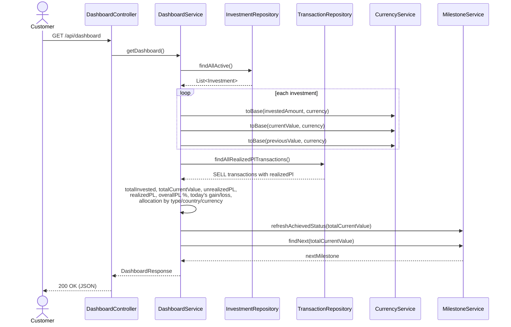
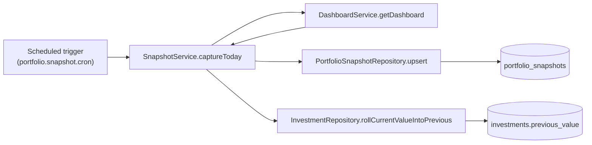
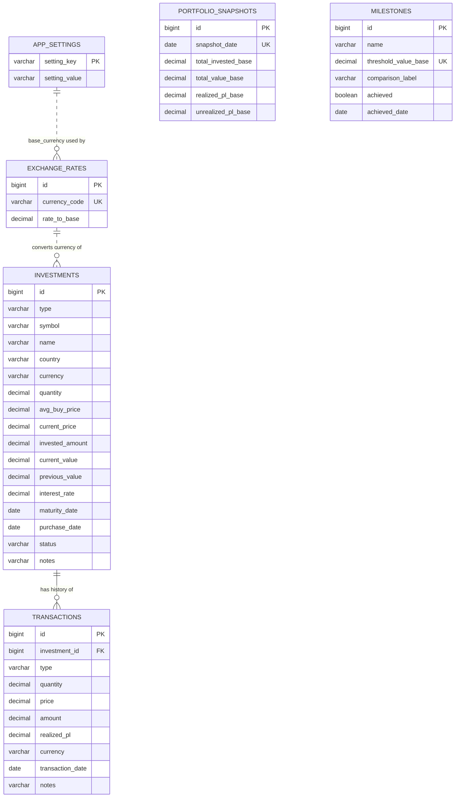
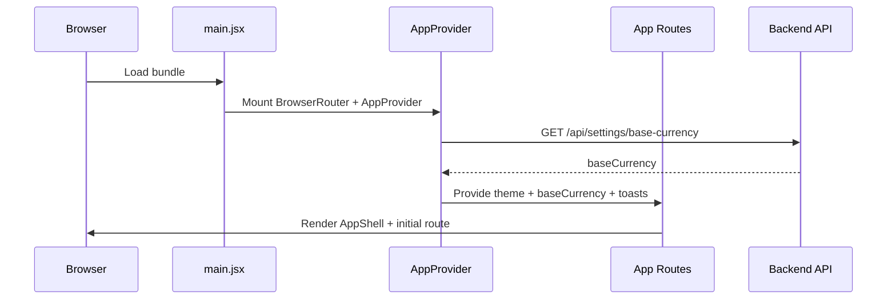
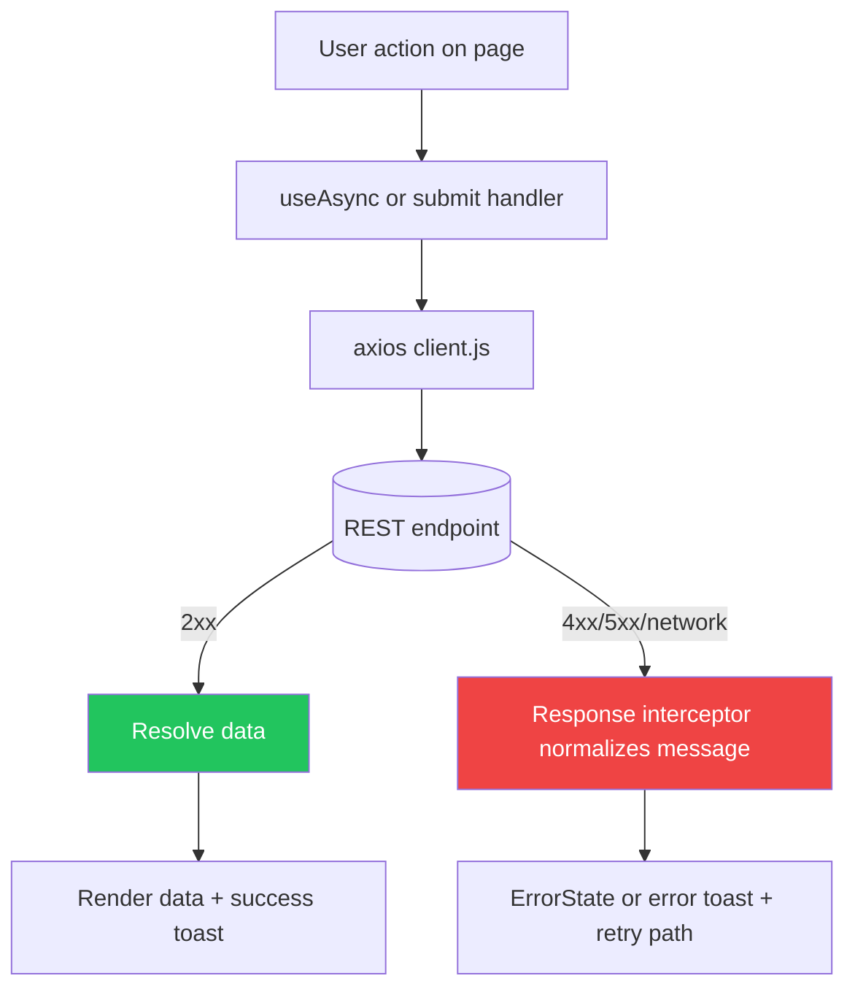

# Portfolio Manager — Backend

A REST API backend that lets a customer track stocks, ETFs, fixed deposits (FDs) and
cash from one place — across multiple countries and currencies — with a single
consolidated dashboard, realized vs. unrealized P/L, performance history, and
wealth milestones.

Built with **Spring Boot + plain JDBC (no JPA/Hibernate) + MySQL + Docker**, following
an agile approach: the data model and API are intentionally minimal-but-complete for
v1, and are structured so new investment types, metrics, or endpoints can be added
without reworking existing pieces.

> This document assumes familiarity with the customer requirements captured in
> `Customer_Interaction.md` — single dashboard, multi-currency, realized/unrealized
> P/L, visual performance history, daily wealth overview, and milestones.

---

## Table of Contents

1. [Tech Stack](#tech-stack)
2. [High-Level Architecture](#high-level-architecture)
3. [Project / Package Structure](#project--package-structure)
4. [Data Flow](#data-flow)
5. [Database Design](#database-design)
6. [Entity-Relationship Diagram](#entity-relationship-diagram)
7. [Core Domain Logic](#core-domain-logic)
8. [API Overview](#api-overview)
9. [Frontend Enterprise System Design](#frontend-enterprise-system-design)
10. [Running the Project](#running-the-project)
11. [Configuration](#configuration)
12. [Mock/Test Data](#mocktest-data)
13. [Design Decisions & Trade-offs](#design-decisions--trade-offs)
14. [Roadmap / Future Iterations](#roadmap--future-iterations)

---

## Tech Stack

| Concern             | Choice                                          |
|---------------------|--------------------------------------------------|
| Language / Runtime  | Java 21                                           |
| Framework           | Spring Boot 3.3.x                                 |
| Persistence         | Spring JDBC (`JdbcTemplate`) — **no JPA/Hibernate** |
| Database            | MySQL 8.0                                         |
| Schema migrations   | Flyway                                            |
| API documentation   | springdoc-openapi (Swagger UI)                    |
| Build tool          | Maven                                             |
| Containerization    | Docker + docker-compose                           |
| Boilerplate         | Lombok                                            |
| Testing             | JUnit 5                                           |

**Why plain JDBC instead of JPA?** Explicit SQL keeps full control over the exact
queries executed, avoids ORM "magic" (lazy-loading pitfalls, N+1 queries, implicit
flushes) while the schema is still actively evolving, and makes the generated SQL
predictable enough to reason about and tune as data volume grows.

---

## High-Level Architecture

The service follows a classic **layered architecture**. Each layer only talks to the
layer directly beneath it, which keeps business logic out of controllers and SQL out
of services.



**Layer responsibilities**

- **Controller** (`controller/`) — thin. Maps HTTP verbs/paths to service calls, applies
  `@Valid` request validation, returns DTOs. No business logic.
- **Service** (`service/`) — owns all business rules: average-cost calculation on BUY,
  realized P/L on SELL, currency conversion to base currency, dashboard aggregation,
  milestone progress, snapshotting.
- **Repository** (`repository/`) — one class per table, built on `JdbcTemplate`. Owns
  all SQL. Returns/accepts domain model objects, never DTOs.
- **Mapper** (`mapper/`) — `RowMapper<T>` implementations that convert a JDBC
  `ResultSet` row into a domain model object.
- **Model** (`model/`) — plain domain objects (`Investment`, `Transaction`,
  `ExchangeRate`, `Milestone`, `PortfolioSnapshot`) — these mirror table rows.
- **DTO** (`dto/`) — request/response shapes exposed over the API; kept separate from
  domain models so the API contract can evolve independently of the schema.

---

## Project / Package Structure

```
portfolio-manager/
├── pom.xml
├── Dockerfile
├── docker-compose.yml
├── .env.example
├── src/main/java/com/portfoliomanager/
│   ├── PortfolioManagerApplication.java
│   ├── config/
│   │   ├── OpenApiConfig.java
│   │   └── WebConfig.java              # CORS
│   ├── controller/
│   │   ├── InvestmentController.java
│   │   ├── TransactionController.java
│   │   ├── DashboardController.java
│   │   ├── MilestoneController.java
│   │   └── ExchangeRateController.java
│   ├── service/
│   │   ├── InvestmentService.java
│   │   ├── TransactionService.java
│   │   ├── DashboardService.java
│   │   ├── CurrencyService.java
│   │   ├── MilestoneService.java
│   │   └── SnapshotService.java
│   ├── repository/
│   │   ├── InvestmentRepository.java
│   │   ├── TransactionRepository.java
│   │   ├── ExchangeRateRepository.java
│   │   ├── MilestoneRepository.java
│   │   ├── PortfolioSnapshotRepository.java
│   │   └── SettingRepository.java
│   ├── mapper/                          # RowMapper<T> per table
│   ├── model/                           # Investment, Transaction, ExchangeRate, ...
│   ├── dto/                             # *Request / *Response objects
│   ├── exception/                       # ResourceNotFoundException, GlobalExceptionHandler
│   └── scheduler/
│       └── DailySnapshotScheduler.java  # daily wealth snapshot job
└── src/main/resources/
    ├── application.yml
    ├── application-dev.yml              # adds mock-data Flyway location
    └── db/
        ├── migration/                   # V1, V2 — schema + reference data (always applied)
        └── testdata/                    # V3 — mock data (dev profile only)
```

---

## Data Flow

### 1. Adding an investment and buying more of it



### 2. Dashboard computation (the "single dashboard" requirement)



### 3. Daily wealth snapshot (scheduled job)



This is what powers **"today's gain/loss"** (`current_value - previous_value`) and the
**performance chart** (`GET /api/dashboard/performance`).

---

## Database Design

All tables are created via Flyway migration `V1__init_schema.sql`, seeded with
reference data in `V2__seed_reference_data.sql`, and (optionally, dev-only) populated
with realistic sample data by `V3__mock_portfolio_data.sql`.

### `investments`
One row per holding/position. Fields are intentionally universal across all four
investment types so dashboard aggregation logic doesn't need type-specific branches.

| Column            | Type          | Notes                                                        |
|--------------------|---------------|---------------------------------------------------------------|
| id                | BIGINT PK      | auto-increment                                                |
| type              | VARCHAR(10)    | `STOCK`, `ETF`, `FD`, `CASH`                                  |
| symbol            | VARCHAR(30)    | ticker or reference code                                      |
| name              | VARCHAR(150)   | display name                                                  |
| country           | VARCHAR(50)    | India, US, UK, Europe, China, ...                              |
| currency          | VARCHAR(3)     | ISO code (INR, USD, GBP, EUR, CNY, ...)                        |
| quantity          | DECIMAL(20,6)  | STOCK/ETF only — units held                                    |
| avg_buy_price     | DECIMAL(20,6)  | STOCK/ETF only — weighted average cost per unit                |
| current_price     | DECIMAL(20,6)  | STOCK/ETF only — latest known market price per unit            |
| invested_amount   | DECIMAL(20,6)  | **universal** — total cost basis, instrument currency          |
| current_value     | DECIMAL(20,6)  | **universal** — current market value, instrument currency      |
| previous_value    | DECIMAL(20,6)  | value as of previous snapshot — powers today's gain/loss        |
| interest_rate     | DECIMAL(6,3)   | FD only — annual %                                              |
| maturity_date     | DATE           | FD only                                                         |
| purchase_date     | DATE           | when the position was opened                                    |
| status            | VARCHAR(10)    | `ACTIVE`, `CLOSED`                                              |
| notes             | VARCHAR(255)   | free text                                                       |
| created_at/updated_at | TIMESTAMP  | audit columns                                                    |

### `transactions`
Full audit trail of every BUY / SELL / DEPOSIT / WITHDRAW / INTEREST event. This is
what makes realized P/L possible without mutating history.

| Column            | Type          | Notes                                            |
|--------------------|---------------|----------------------------------------------------|
| id                | BIGINT PK      |                                                     |
| investment_id     | BIGINT FK      | → `investments.id`, `ON DELETE CASCADE`             |
| type              | VARCHAR(10)    | `BUY`, `SELL`, `DEPOSIT`, `WITHDRAW`, `INTEREST`    |
| quantity          | DECIMAL(20,6)  | BUY/SELL only                                       |
| price             | DECIMAL(20,6)  | BUY/SELL only                                       |
| amount            | DECIMAL(20,6)  | total transaction amount, instrument currency        |
| realized_pl       | DECIMAL(20,6)  | populated only on SELL                              |
| currency          | VARCHAR(3)     | copied from parent investment at transaction time    |
| transaction_date  | DATE           | when the event happened                             |
| notes             | VARCHAR(255)   |                                                       |
| created_at        | TIMESTAMP      |                                                       |

### `exchange_rates`
Rate to convert 1 unit of `currency_code` into the customer's base currency — lets
the customer view every investment in **both its original currency and their
preferred base currency**.

| Column        | Type          | Notes                          |
|----------------|---------------|----------------------------------|
| id            | BIGINT PK      |                                   |
| currency_code | VARCHAR(3) UQ  | e.g. USD                          |
| rate_to_base  | DECIMAL(20,8)  | 1 USD = X (base currency)          |
| updated_at    | TIMESTAMP      |                                   |

### `app_settings`
Simple key/value store — currently holds `base_currency`.

### `portfolio_snapshots`
One row per day; powers the performance chart and daily wealth history.

| Column               | Type          |
|-----------------------|---------------|
| id                    | BIGINT PK      |
| snapshot_date         | DATE UNIQUE    |
| total_invested_base   | DECIMAL(20,6)  |
| total_value_base      | DECIMAL(20,6)  |
| realized_pl_base      | DECIMAL(20,6)  |
| unrealized_pl_base    | DECIMAL(20,6)  |
| created_at            | TIMESTAMP      |

### `milestones`
Feel-good wealth milestones (e.g. "portfolio crossed the price of a luxury car").

| Column                | Type           |
|------------------------|----------------|
| id                     | BIGINT PK       |
| name                   | VARCHAR(100)    |
| threshold_value_base   | DECIMAL(20,2) UQ|
| comparison_label       | VARCHAR(150)    |
| achieved               | BOOLEAN         |
| achieved_date          | DATE            |
| created_at             | TIMESTAMP       |

---

## Entity-Relationship Diagram



> `PORTFOLIO_SNAPSHOTS` and `MILESTONES` are intentionally **not** foreign-keyed to
> `INVESTMENTS` — they're derived/aggregate and reference-data tables respectively, so
> they're computed by the service layer rather than joined in SQL. `EXCHANGE_RATES`
> and `APP_SETTINGS` are logical, not enforced-FK, relationships (investments store a
> currency *code*, looked up at read time) — this keeps currency data easy to update
> without cascading changes across every investment row.

---

## Core Domain Logic

### Weighted-average cost on BUY
```
newQty  = oldQty + boughtQty
newAvg  = (oldQty * oldAvg + boughtQty * boughtPrice) / newQty
investedAmount = newQty * newAvg
currentValue   = newQty * currentPrice
```

### Realized P/L on SELL
```
realizedPl = soldQty * (sellPrice - avgBuyPrice)
newQty = oldQty - soldQty
investedAmount = newQty * avgBuyPrice     # avg cost is unchanged by a sell
currentValue   = newQty * currentPrice
status = CLOSED if newQty == 0
```

### Dashboard aggregation (per customer's requested single-view)
```
totalInvested     = Σ toBase(investment.investedAmount)      over ACTIVE investments
totalCurrentValue = Σ toBase(investment.currentValue)         over ACTIVE investments
totalPreviousValue= Σ toBase(investment.previousValue)        over ACTIVE investments

unrealizedPL  = totalCurrentValue - totalInvested
realizedPL    = Σ toBase(transaction.realizedPl)  over all SELL transactions
overallPL     = unrealizedPL + realizedPL
overallPL%    = overallPL / totalInvested * 100

todayGainLoss  = totalCurrentValue - totalPreviousValue
todayGainLoss% = todayGainLoss / totalPreviousValue * 100
```

Allocation breakdowns (by `type`, `country`, `currency`) group active investments and
express each group's `current_value` (converted to base currency) as a value + % of
`totalCurrentValue`.

### Currency conversion
Every amount is stored in its **instrument's original currency**. Conversion to the
customer's base currency happens at read time in `CurrencyService.toBase()`, using the
latest rate in `exchange_rates`. This keeps historical instrument-currency figures
accurate even if exchange rates change later, while dashboard totals always reflect
current rates.

---

## API Overview

Full interactive documentation is served by Swagger UI at `/swagger-ui.html` once the
app is running. Summary:

| Method | Path                                              | Purpose                                   |
|--------|----------------------------------------------------|---------------------------------------------|
| GET    | `/api/investments`                                 | list (filter by type/country/status)         |
| GET    | `/api/investments/{id}`                            | get one                                        |
| POST   | `/api/investments`                                 | add an investment                              |
| PUT    | `/api/investments/{id}`                            | update descriptive fields                     |
| PATCH  | `/api/investments/{id}/price`                      | refresh market price/value                    |
| DELETE | `/api/investments/{id}`                            | remove                                         |
| GET    | `/api/investments/{id}/transactions`               | transaction history for one investment        |
| POST   | `/api/investments/{id}/transactions`                | record BUY/SELL/DEPOSIT/WITHDRAW/INTEREST     |
| GET    | `/api/transactions`                                | all transactions                              |
| GET    | `/api/dashboard`                                   | consolidated dashboard                        |
| GET    | `/api/dashboard/performance?from=&to=`             | performance history for charting               |
| POST   | `/api/dashboard/snapshot`                          | manually trigger today's snapshot              |
| GET    | `/api/milestones`                                  | milestones + progress                          |
| POST   | `/api/milestones`                                  | add a custom milestone                         |
| DELETE | `/api/milestones/{id}`                             | remove a milestone                             |
| GET/PUT| `/api/settings/base-currency`                      | get/set base currency                          |
| GET    | `/api/exchange-rates`                              | list configured rates                          |
| PUT    | `/api/exchange-rates/{code}`                       | create/update a rate                           |

---

## Frontend Enterprise System Design

The frontend (`Frontend/`) is designed as a modular React SPA that prioritizes
portfolio-readability, operational reliability, and maintainable growth. The
design below captures both current implementation and enterprise-grade standards
to guide future iterations.

### 1) Frontend architecture goals

- **Fast comprehension**: dashboard-first UX where net worth, daily move, and next
  milestone are visible within the first viewport.
- **Contract resilience**: tolerate DTO field-name drift with centralized mapping
  utilities (`pick(...)`) until backend contracts are locked.
- **Operational safety**: deterministic API layer, consistent error handling,
  and clear user feedback through toasts and empty/error states.
- **Extensibility**: feature-oriented folders so teams can add modules (watchlist,
  notifications, auth) with bounded impact.

### 2) Logical frontend architecture

```mermaid
flowchart LR
    U[User] --> R[Router
    BrowserRouter + Route Tree]
    R --> L[AppShell Layout
    Sidebar + Topbar + Mobile Tabs]
    L --> P[Page Modules
    Dashboard | Investments | Transactions | Milestones | Settings]

    P --> C[Shared UI Components
    cards, drawers, dialogs, table, skeletons]
    P --> X[App Context
    theme, baseCurrency, toast bus]
    P --> H[Data Hook
    useAsync lifecycle]
    H --> A[API Client
    axios instance + interceptors]
    A --> B[(Spring Boot REST API)]

    style A fill:#0ea5e9,color:#fff
    style X fill:#10b981,color:#fff
    style P fill:#4f46e5,color:#fff
```

### 3) Runtime bootstrap flow



### 4) Page-to-data flow (current behavior)

- **Dashboard**:
  calls `GET /api/dashboard`, `GET /api/dashboard/performance`, and recent
  transactions; also supports `POST /api/dashboard/snapshot` for a manual snapshot.
- **Investments**:
  type-filtered listing, create/update/delete workflows, and manual market price
  refresh through `PATCH /api/investments/{id}/price`.
- **Transactions**:
  ledger view with create workflow per investment using
  `POST /api/investments/{id}/transactions`.
- **Milestones**:
  list/create/delete milestone operations with progress visualization.
- **Settings**:
  theme, base currency update, and exchange-rate updates.

### 5) Request lifecycle and error model



Standards:

- Every mutating action must expose a deterministic success/error toast.
- Every data-loading page must provide loading, empty, and error states.
- Every API call must flow through a single client (`src/api/client.js`) to keep
  headers, base URL, and error normalization centralized.

### 6) Enterprise folder boundaries

Recommended ownership model for `Frontend/src`:

- `api/`: transport contract and endpoint wrappers only.
- `context/`: cross-cutting application concerns (theme, base currency, toast bus).
- `pages/`: route-level orchestration and business flow wiring.
- `components/`: pure/reusable UI and feature components.
- `utils/`: formatting, mapping, and stateless helpers.

This aligns with a domain-driven frontend model where route modules orchestrate,
shared components remain mostly presentational, and API logic never leaks into UI
building blocks.

### 7) State management strategy

- **Global state (Context)**: theme, user-level display preferences, global toasts,
  and base currency.
- **Server state (`useAsync`)**: page/resource data loaded from backend endpoints.
- **Local component state**: temporary UI states (drawer open/close, form drafts,
  confirmation dialog selection).

Growth path:

- If caching, background revalidation, and query invalidation become complex,
  migrate `useAsync` flows to a query library (TanStack Query) without changing
  route structure.

### 8) Security, compliance, and data protection requirements

- Never persist secrets or tokens in source or local storage.
- Keep `VITE_API_BASE_URL` environment-driven per environment.
- Enforce strict input validation client-side for obvious data-shape issues,
  while treating backend validation as source of truth.
- Sanitize and safely render all user-generated strings (React default escaping
  already protects against basic HTML injection).
- Add Content Security Policy (CSP), `X-Content-Type-Options`, and `Referrer-Policy`
  at the reverse-proxy layer in production.
- Use HTTPS-only deployment for any non-local environment.

### 9) Performance and scalability standards

- Keep initial route payload lean; defer secondary panels until critical stats load.
- Split heavyweight routes/components with lazy loading when bundle size grows.
- Memoize expensive computed data and chart transformations.
- Use pagination/virtualization for long investment and transaction datasets.
- Set explicit web-vitals targets:
  - Largest Contentful Paint (LCP): < 2.5s
  - Interaction to Next Paint (INP): < 200ms
  - Cumulative Layout Shift (CLS): < 0.1

### 10) Accessibility and UX quality baseline

- WCAG 2.2 AA contrast for all text and controls in light and dark themes.
- Keyboard navigation for drawers, dialogs, tab bars, and filters.
- Proper `aria-*` labels for icon-only action buttons.
- Screen-reader friendly error/success messaging for toast announcements.
- Mobile-first layout parity with desktop for all core workflows.

### 11) Testing strategy for enterprise readiness

- **Unit tests**: formatting utilities, mapping helpers, and any non-trivial
  calculation/transform logic.
- **Component tests**: loading/empty/error/success rendering states.
- **Integration tests**: page-level API interaction paths using mocked API server.
- **E2E tests**: critical user journeys:
  - add investment -> add transaction -> dashboard refresh
  - change base currency -> totals and rates update
  - create milestone -> progress shown on dashboard

Minimum CI gate recommendation:

- Lint + build must pass on pull request.
- Test suite must pass with stable deterministic fixtures.
- No high-severity dependency vulnerabilities in release branches.

### 12) Observability and operational readiness

- Instrument frontend error tracking (Sentry or equivalent) with route and action context.
- Add request correlation IDs propagated from backend headers when available.
- Capture key business telemetry:
  dashboard load time, snapshot trigger success rate, transaction create failure rate.
- Track release health for first 24h after deployment with alert thresholds.

### 13) Delivery pipeline and environment strategy

- **Local**: Vite dev server with `/api` proxy to Spring Boot.
- **Build**: static asset build (`npm run build`) with environment-specific API base URL.
- **Deploy**: CDN/static hosting or containerized Nginx serving `dist`.
- **Versioning**: semantic version tags aligned to backend release notes.
- **Rollback**: immutable artifact rollback policy for failed releases.

### 14) Frontend governance checklist (Definition of Done)

Every frontend feature is production-ready only when all are true:

- API contract documented and validated against Swagger/OpenAPI.
- Loading, empty, error, and success states implemented.
- Accessibility checks complete (keyboard + screen reader + contrast).
- Unit/component/integration coverage added for non-trivial behavior.
- Observability events and error monitoring wired.
- Performance impact reviewed (bundle and runtime).
- Security review completed for input handling and configuration.

---

## Running the Project

### Option A — Docker Compose (recommended)

```bash
cp .env.example .env
docker compose up --build
```

This starts MySQL + the app together, applies Flyway migrations automatically, and
exposes:
- API: `http://localhost:8080`
- Swagger UI: `http://localhost:8080/swagger-ui.html`
- Health check: `http://localhost:8080/actuator/health`

To also load realistic mock data (see [Mock/Test Data](#mocktest-data)):
```bash
SPRING_PROFILES_ACTIVE=dev docker compose up --build
```

### Option B — Local (MySQL running separately)

```bash
mvn clean package
java -jar target/portfolio-manager.jar \
  --DB_URL=jdbc:mysql://localhost:3306/portfolio_manager \
  --DB_USERNAME=portfolio_user \
  --DB_PASSWORD=portfolio_pass
```

---

## Configuration

All configuration is environment-variable driven (see `application.yml`):

| Variable        | Default                                                    | Purpose                         |
|------------------|--------------------------------------------------------------|-----------------------------------|
| `DB_URL`        | `jdbc:mysql://localhost:3306/portfolio_manager?...`           | JDBC connection string             |
| `DB_USERNAME`   | `portfolio_user`                                              |                                     |
| `DB_PASSWORD`   | `portfolio_pass`                                              |                                     |
| `SERVER_PORT`   | `8080`                                                        |                                     |
| `BASE_CURRENCY` | `INR`                                                         | initial base currency seed value   |
| `SNAPSHOT_CRON` | `0 5 0 * * *`                                                 | when the daily snapshot job runs   |
| `SPRING_PROFILES_ACTIVE` | *(none)*                                             | set to `dev` to load mock data     |

---

## Mock/Test Data

`db/testdata/V3__mock_portfolio_data.sql` inserts a realistic portfolio spanning all
four investment types, all five countries the customer mentioned, six currencies, an
open **and** a fully-closed stock position (to exercise realized P/L), a cash deposit,
FD interest accrual, and 7 days of snapshot history for the performance chart.

It is wired in via `application-dev.yml`, which extends Flyway's scan locations —
**it never runs unless the `dev` profile is active**, so a production run stays on a
clean schema with just the default reference data from `V2`.

```bash
SPRING_PROFILES_ACTIVE=dev docker compose up --build
curl http://localhost:8080/api/dashboard
```

---

## Design Decisions & Trade-offs

- **Universal `invested_amount` / `current_value` columns** on `investments`, rather
  than type-specific tables (e.g. a separate `fixed_deposits` table) — keeps dashboard
  aggregation a single query/loop instead of a UNION across type-specific tables. The
  trade-off is a handful of nullable, type-specific columns (`quantity`,
  `avg_buy_price`, `interest_rate`, ...). Given the customer wants "one place" to see
  everything, this favored read-simplicity over strict normalization.
- **No JPA** — plain JDBC was requested; it also avoids ORM lazy-loading/N+1 surprises
  while the schema is still expected to change frequently during early sprints.
- **Flyway over `schema.sql`/`data.sql`** — every schema change is versioned and
  auditable, which matters once the team starts shipping schema changes iteratively.
- **Mock data isolated to a Spring profile** — keeps the seed/demo data out of
  production migrations entirely, rather than relying on manual cleanup.
- **No authentication/authorization yet** — out of scope for this pass per current
  requirements (single customer, backend-focused iteration). CORS is currently
  permissive (`*`) and should be tightened once a real frontend origin and auth model
  are defined.
- **No external market-data integration** — current prices are refreshed manually via
  `PATCH /api/investments/{id}/price`. Automated price feeds are a natural next step
  once the customer confirms which data provider(s) to use.

---

## Roadmap / Future Iterations

Per the agile approach, these are natural next increments once customer feedback
comes in — not built now, to avoid over-engineering ahead of validated need:

- Authentication / multi-user support
- Live market price feeds (stocks/ETFs) instead of manual price refresh
- More investment types (mutual funds, bonds, crypto, real estate)
- Pagination/sorting on list endpoints as portfolios grow
- Rate history (instead of a single current FX rate) for more accurate historical
  realized P/L conversion
- Notifications when a milestone is achieved
