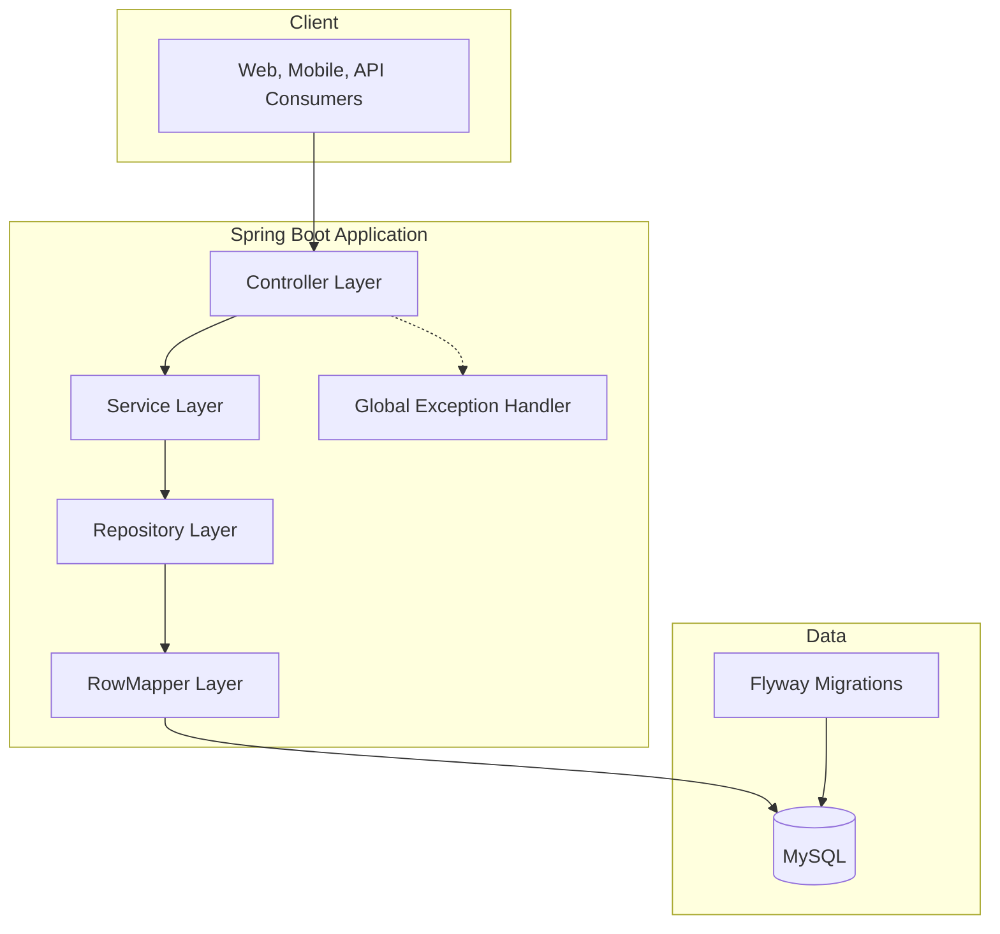

# How the System Is Organized

This backend is designed so each part has one clear responsibility. That keeps the system easier to test, maintain, and extend.

## Business-friendly architecture summary

- API layer: receives requests and returns responses
- Service layer: applies business rules and calculations
- Data access layer: reads and writes portfolio data
- Database: stores investments, transactions, rates, milestones, and snapshots

## High-level flow

## Layer responsibilities in simple terms

- Controller: accepts client requests and triggers the right use case
- Service: computes P/L, dashboard totals, conversions, and milestone progress
- Repository: runs database operations
- Mapper/model/dto: keep internal storage and external API contracts clear and separate

## Why this structure is useful

- Changes in one area are less likely to break others
- Business rules stay centralized and consistent
- New endpoints and features can be added without major rework

## Typical package grouping

- config
- controller
- service
- repository
- mapper
- model
- dto
- exception
- scheduler

## Read next

- [How Calculations and Flows Work](03-domain-logic-and-data-flow.md)
- [Data Model and Entity Relationships](04-database-design-and-erd.md)
