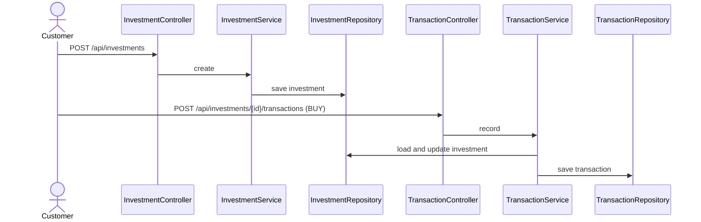
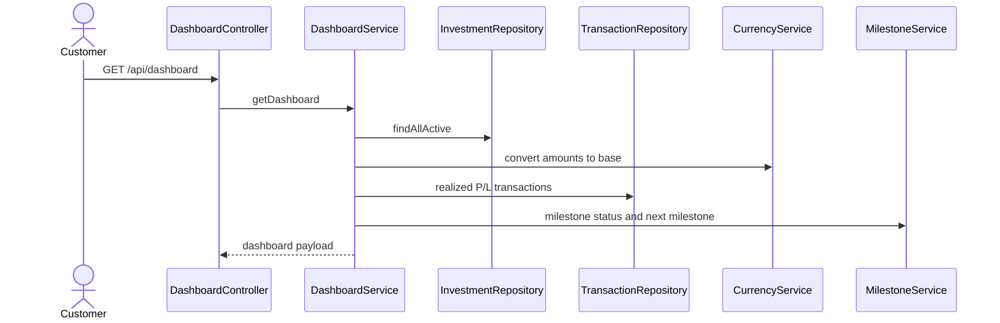
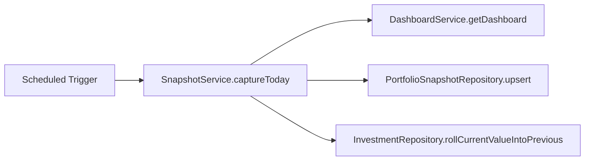

# How Calculations and Flows Work

This section explains how the backend keeps portfolio numbers accurate and consistent.

## Core calculation rules

### Weighted average price after a buy

- newQty = oldQty + boughtQty
- newAvg = ((oldQty x oldAvg) + (boughtQty x boughtPrice)) / newQty
- investedAmount = newQty x newAvg
- currentValue = newQty x currentPrice

### Realized profit/loss on sell

- realizedPl = soldQty x (sellPrice - avgBuyPrice)
- newQty = oldQty - soldQty
- investedAmount = newQty x avgBuyPrice
- currentValue = newQty x currentPrice
- status becomes CLOSED if newQty equals zero

### Dashboard consolidation

- totalInvested = total cost basis across active investments
- totalCurrentValue = latest value across active investments
- totalPreviousValue = previous snapshot value across active investments
- unrealizedPL = totalCurrentValue - totalInvested
- realizedPL = total realized gain/loss from completed sell events
- overallPL = unrealizedPL + realizedPL
- overallPLPercent = (overallPL / totalInvested) x 100
- todayGainLoss = totalCurrentValue - totalPreviousValue
- todayGainLossPercent = (todayGainLoss / totalPreviousValue) x 100

### Currency conversion model

Amounts stay in original investment currency for data integrity, then are converted to the customer base currency when dashboards and reports are generated.

## Key business flows

### Add investment and then buy more

### Build single dashboard view

### Daily snapshot for trend and day-change metrics

