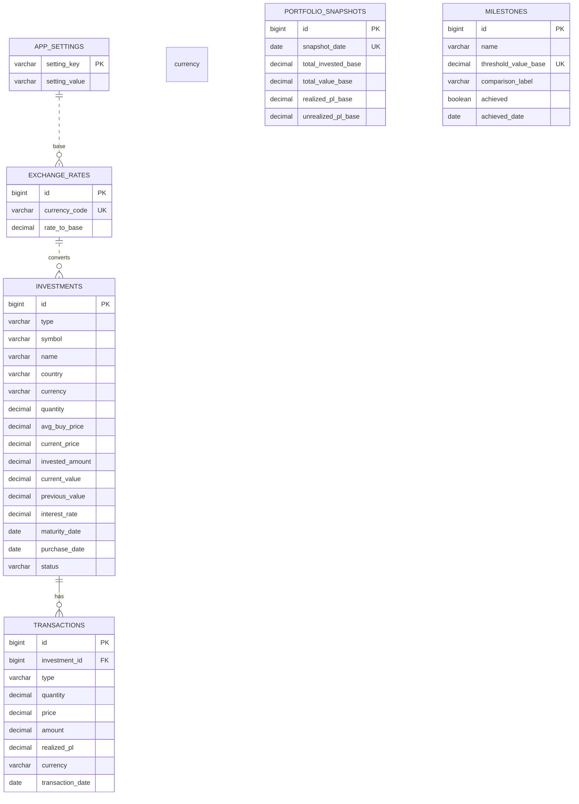

# Data Model and Entity Relationships

The database is organized for clear auditability, accurate calculations, and predictable reporting.

Schema changes are versioned through migrations:

- V1: initial schema
- V2: baseline reference data
- V3: development-only sample data

## Main data groups

### investments (current holdings)

One record per position. Supports all asset types needed in v1 while preserving a common structure for dashboard aggregation.

Key columns:

- id (PK)
- type: STOCK, ETF, FD, CASH
- symbol, name, country, currency
- quantity, avg_buy_price, current_price
- invested_amount, current_value, previous_value
- interest_rate, maturity_date, purchase_date
- status: ACTIVE or CLOSED

### transactions (full activity history)

Complete event history for buys, sells, deposits, withdrawals, and interest movements.

Key columns:

- id (PK)
- investment_id (FK to investments.id)
- type
- quantity, price, amount
- realized_pl
- currency, transaction_date

### exchange_rates (currency conversion)

Stores conversion rates from instrument currency to customer base currency.

Key columns:

- id (PK)
- currency_code (unique)
- rate_to_base
- updated_at

### app_settings (platform settings)

Simple key/value settings storage, including base currency.

### portfolio_snapshots (daily trend source)

Daily totals used for performance charts and day-over-day movement.

### milestones (goal tracking)

Customer-defined wealth targets and achievement status.

## Entity relationship diagram

## Modeling notes

- Snapshots and milestones are derived/reference data, so they are managed by service logic rather than direct row-by-row linking.
- Investment currency is preserved at source, and conversion happens when values are shown in base currency.
- Shared invested/current value fields make single-dashboard consolidation simple and consistent.
