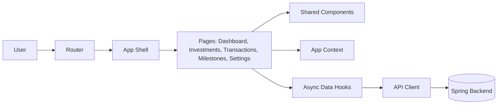
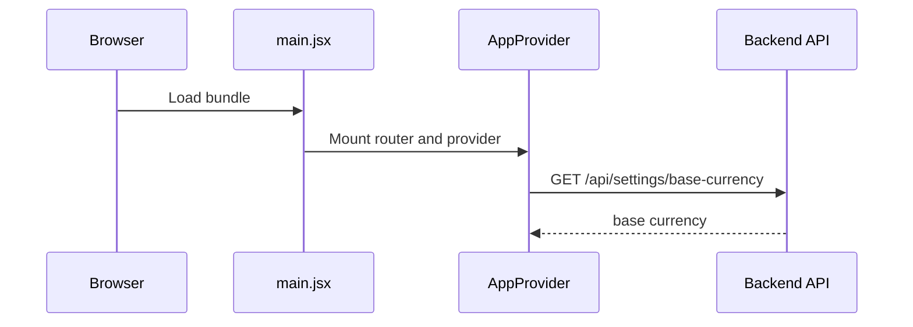

# Frontend Design Approach

This guide explains how the frontend is structured to deliver fast comprehension, operational reliability, and long-term scalability.

## Product goals for the frontend

- Fast understanding with dashboard-first UX
- Stable integration with backend contracts
- Clear user feedback for success, loading, empty, and failure states
- Feature growth without major refactoring

## Logical frontend architecture

## Startup flow

## Page responsibilities

- Dashboard: dashboard, performance history, snapshot trigger
- Investments: list, create/update/delete, manual price update
- Transactions: ledger and transaction creation
- Milestones: list/create/delete and progress visualization
- Settings: base currency and exchange rate management

## Request lifecycle standard

- All calls pass through one API client module
- Every page supports loading, empty, and error states
- Every mutation shows deterministic success or failure feedback

## Folder boundary recommendation

- api: transport wrappers only
- context: cross-cutting global state
- pages: route-level orchestration
- components: reusable presentational pieces
- utils: stateless helpers and formatters

## Quality baseline

- Accessibility: keyboard support, readable contrast, and assistive labels
- Performance: web-vitals targets suitable for production UX
- Testing: layered tests from utility to end-to-end journeys
- Observability: error and action tracking for release confidence
- Security: environment-driven configuration and HTTPS for non-local use
